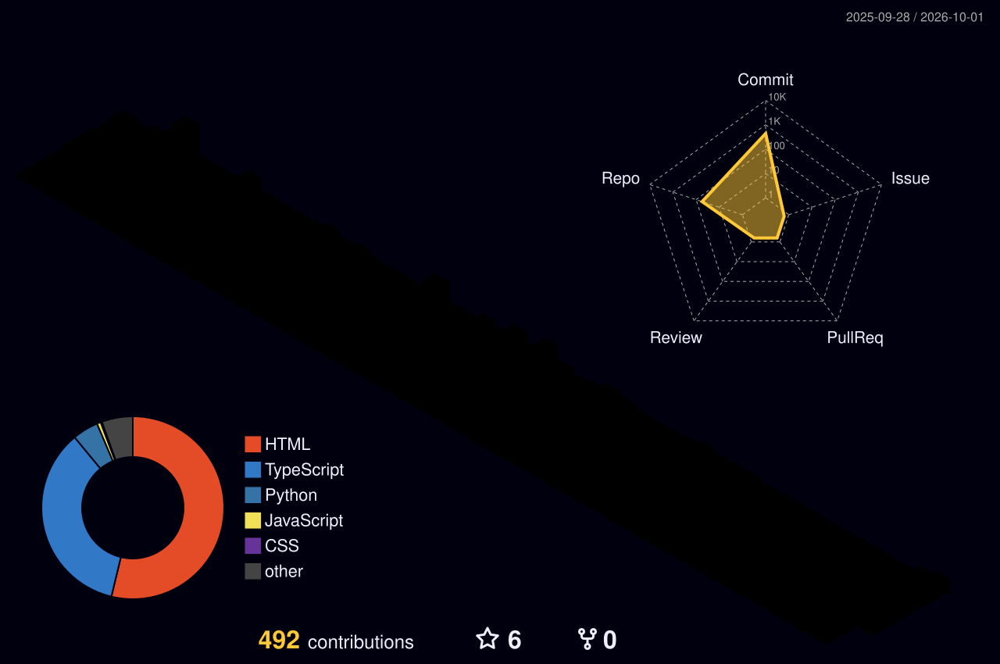

# 🧙🏻‍♂️ Alfredo Allan Teixeira Sousa

### 💻 Desenvolvedor Full Stack &nbsp;·&nbsp; 🔐 Segurança da Informação &nbsp;·&nbsp; ☁️ Cloud Security

🎓 Estudante de **Análise e Desenvolvimento de Sistemas** &nbsp;·&nbsp; 📍 São Paulo, Brasil

 

  

<a href="#-atividade-no-github">📈 Atividade</a> &nbsp;•&nbsp;
<a href="#-mapa-de-habilidades">🧭 Habilidades</a> &nbsp;•&nbsp;
<a href="#-certificações">🏆 Certificações</a> &nbsp;•&nbsp;
<a href="#-projetos-em-destaque">🧪 Projetos</a> &nbsp;•&nbsp;
<a href="#-objetivo-profissional">💡 Objetivo</a> &nbsp;•&nbsp;
<a href="#-conexões">🔗 Conexões</a>

---

## 🧑🏻‍💻 Sobre mim

Sou desenvolvedor e estudante de **Análise e Desenvolvimento de Sistemas**, com foco em aplicações modernas, boas práticas e **segurança da informação**. Meu interesse está em entender não só como um sistema funciona, mas como ele é **protegido, mantido e escalado** com confiança.

> **Um sistema eficiente precisa ser funcional, escalável, seguro e confiável.**

Hoje construo minha base técnica com projetos práticos em desenvolvimento Full Stack, Linux, Redes, AWS e Cibersegurança — e tudo o que aparece neste perfil pode ser conferido nos repositórios e nos gráficos abaixo.

---

## 📈 Atividade no GitHub

Gráficos gerados automaticamente todos os dias a partir da minha atividade real no GitHub.

  

<!-- Contribuições em 3D (gerado por .github/workflows/profile-3d.yml) -->
<picture>
  <source media="(prefers-color-scheme: dark)" srcset="./profile-3d-contrib/profile-night-rainbow.svg" />
  <source media="(prefers-color-scheme: light)" srcset="./profile-3d-contrib/profile-season-animate.svg" />
  
</picture>

  

<!-- Cobrinha comendo o gráfico de contribuições (gerado por .github/workflows/snake.yml) -->
<picture>
  <source media="(prefers-color-scheme: dark)" srcset="https://raw.githubusercontent.com/alfredo-allan/alfredo-allan/output/github-snake-dark.svg" />
  <source media="(prefers-color-scheme: light)" srcset="https://raw.githubusercontent.com/alfredo-allan/alfredo-allan/output/github-snake.svg" />
  
</picture>

  

<!-- Sequência de dias contribuindo -->

  

<!-- Linha do tempo de contribuições -->

<b>📅 Ver o ano completo, hábitos de código e conquistas</b>

 

<!-- Gerado por .github/workflows/metrics.yml -->

---

## 🧭 Mapa de habilidades

Transparência em primeiro lugar: cada habilidade mostra <b>em que estágio está</b> e <b>onde você pode conferir</b>.

<!-- Linguagens calculadas a partir do código dos meus repositórios (gerado por .github/workflows/metrics.yml) -->

☝️ Percentual calculado automaticamente sobre o código dos meus repositórios públicos — não é autoavaliação.

 

| Estágio | O que significa |
|:---:|:---|
| 🟢 **Aplico em projetos** | Uso com autonomia em projetos publicados aqui no GitHub |
| 🔵 **Certificado** | Base formal validada por certificação oficial |
| 🟡 **Em evolução** | Já utilizei, mas sigo aprofundando com estudos e prática |

 

| Área | Tecnologias | Estágio | Onde conferir |
|:---|:---|:---:|:---|
| **Front-end** |  React ·  Next.js ·  TypeScript ·  JavaScript ·  HTML ·  CSS ·  Tailwind | 🟢 | [leap-tech](https://github.com/alfredo-allan/leap-tech) · [ModernEcommerce](https://github.com/alfredo-allan/ModernEcommerce) · [Breakage-Control](https://github.com/alfredo-allan/Breakage-Control) |
| **Back-end & Dados** |  Python ·  Flask · APIs REST | 🟢 | [moderne-commerce-dados](https://github.com/alfredo-allan/moderne-commerce-dados) · [my-make-data](https://github.com/alfredo-allan/my-make-data) |
| **Back-end & Dados** |  FastAPI ·  Node.js ·  PostgreSQL ·  MySQL | 🟡 | Repositórios em andamento |
| **Linux & Shell** |  Linux ·  Bash · Kali Linux | 🔵 | Cisco **Linux Essentials** |
| **Redes** | TCP/IP · IPv4/IPv6 · Switching · Routing · Wireless | 🔵 | Cisco **CCNA** — ITN e SRWE |
| **Segurança** | Fundamentos de cibersegurança · Análise de ameaças · Segurança de redes | 🔵 | Cisco **Junior Cybersecurity Analyst** |
| **Cloud** |  AWS · IAM · Modelo de responsabilidade compartilhada | 🔵 | **AWS Academy** Cloud Security Foundations |
| **DevOps & Ferramentas** |  Git ·  GitHub · GitHub Actions | 🟢 | Histórico de commits e este próprio perfil |
| **DevOps & Ferramentas** |  Docker · Automação com Shell Script | 🟡 | Estudos e projetos pessoais |

---

## 🏆 Certificações

<table>
<tr>
<td width="50%" valign="top">

### ☁️ AWS Academy Graduate
**Cloud Security Foundations**

Segurança em nuvem: modelo de responsabilidade compartilhada, gestão de identidade e acesso e boas práticas na AWS.

`Cloud Security` `AWS` `IAM` `Security Fundamentals`

</td>
<td width="50%" valign="top">

### 🛡️ Cisco Junior Cybersecurity Analyst

Fundamentos de cibersegurança e preparação para atuar em ambientes de segurança da informação.

`Cybersecurity` `Security Operations` `Threat Analysis` `Network Security`

</td>
</tr>
</table>

<b>🌐 Ver certificações Cisco Networking Academy (CCNA e Linux)</b>

 

<table>
<tr>
<td width="33%" valign="top">

#### 🌐 CCNA: Introduction to Networks

Comunicação entre dispositivos, protocolos, endereçamento IP e infraestrutura de redes.

`Networking` `TCP/IP` `IPv4` `IPv6`

</td>
<td width="33%" valign="top">

#### 🔀 CCNA: Switching, Routing and Wireless Essentials

Switching, roteamento e redes sem fio em infraestrutura corporativa.

`Switching` `Routing` `Wireless`

</td>
<td width="33%" valign="top">

#### 🐧 Linux Essentials

Linha de comando, estrutura de arquivos e fundamentos de administração de sistemas.

`Linux` `Shell` `CLI`

</td>
</tr>
</table>

---

## 🧪 Projetos em destaque

| Projeto | Stack | Sobre |
|:---|:---|:---|
| 🚀 [**leap-tech**](https://github.com/alfredo-allan/leap-tech) |    | Site da Leap In Technology: vitrine de templates com parallax 3D, carrosséis mobile e formulário de contato |
| 🛒 [**ModernEcommerce**](https://github.com/alfredo-allan/ModernEcommerce) + [dados](https://github.com/alfredo-allan/moderne-commerce-dados) |   | E-commerce com front-end em TypeScript e camada de dados em Python |
| 📦 [**Breakage-Control**](https://github.com/alfredo-allan/Breakage-Control) |  | Sistema de controle de quebras |
| 🧩 [**My-Make-System**](https://github.com/alfredo-allan/My-Make-System) + [dados](https://github.com/alfredo-allan/my-make-data) |   | Sistema com front-end em TypeScript e serviço de dados em Python |

<a href="https://github.com/alfredo-allan?tab=repositories">Ver todos os repositórios →</a>

---

## 📚 Atualmente explorando

---

## 💡 Objetivo profissional

Busco oportunidades para aplicar e evoluir em:

> **Desenvolvimento de Software + Segurança da Informação + Cloud Computing**

Quero participar da construção de soluções que não sejam apenas funcionais, mas também **seguras, escaláveis e confiáveis**.

---

## 🔗 Conexões

  

### 🚀 "Construindo software com foco em qualidade, segurança e evolução contínua."

